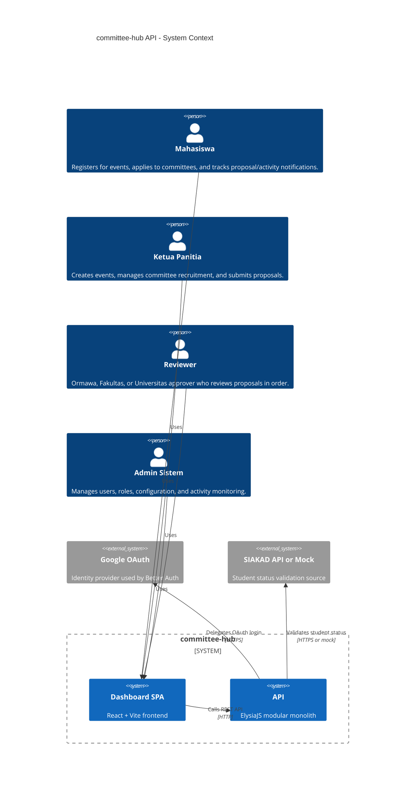
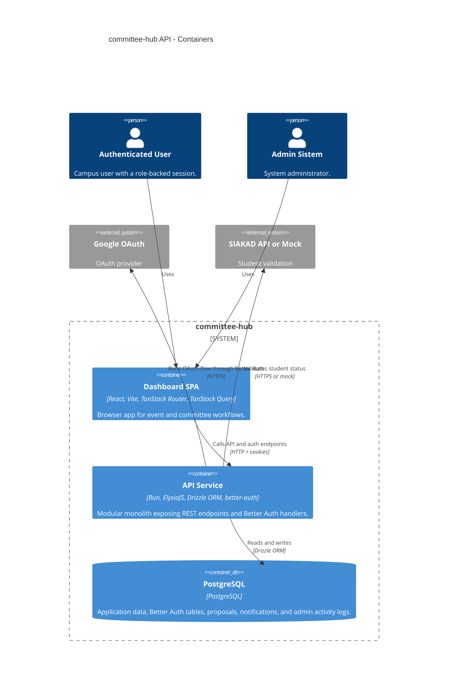
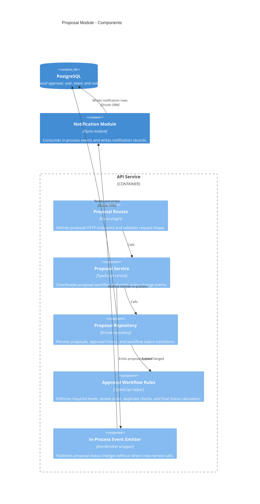
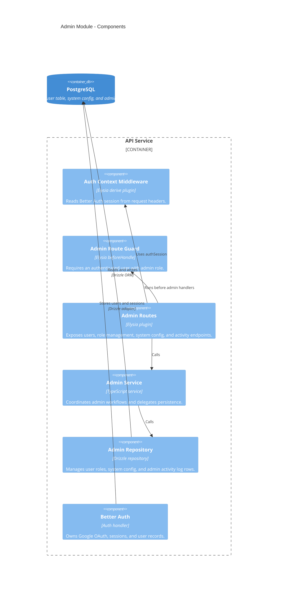

# API C4 Diagrams

Mermaid C4 diagrams for the owned API modules covered by the current backend checklist.

## Context

## Container

## Proposal Component

## Admin Component

## Relationship Notes

- Better Auth owns OAuth, session handling, and auth database tables. The admin module reads and updates the shared `user` table only for role management.
- Proposal status changes are published through the in-process event emitter. The notification module listens for those events and writes notification records.
- The API remains a modular monolith: routes call services, services call their own repositories, and cross-module side effects go through internal events.
- Admin activity monitoring uses `admin_activity_log` for auditable role and system configuration changes.
