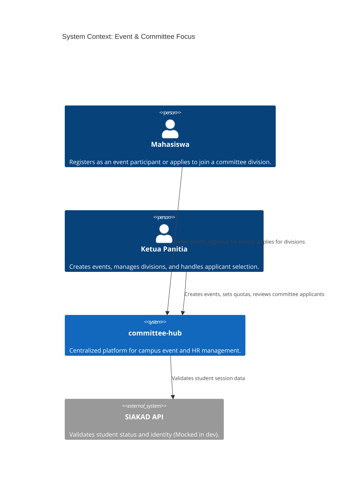
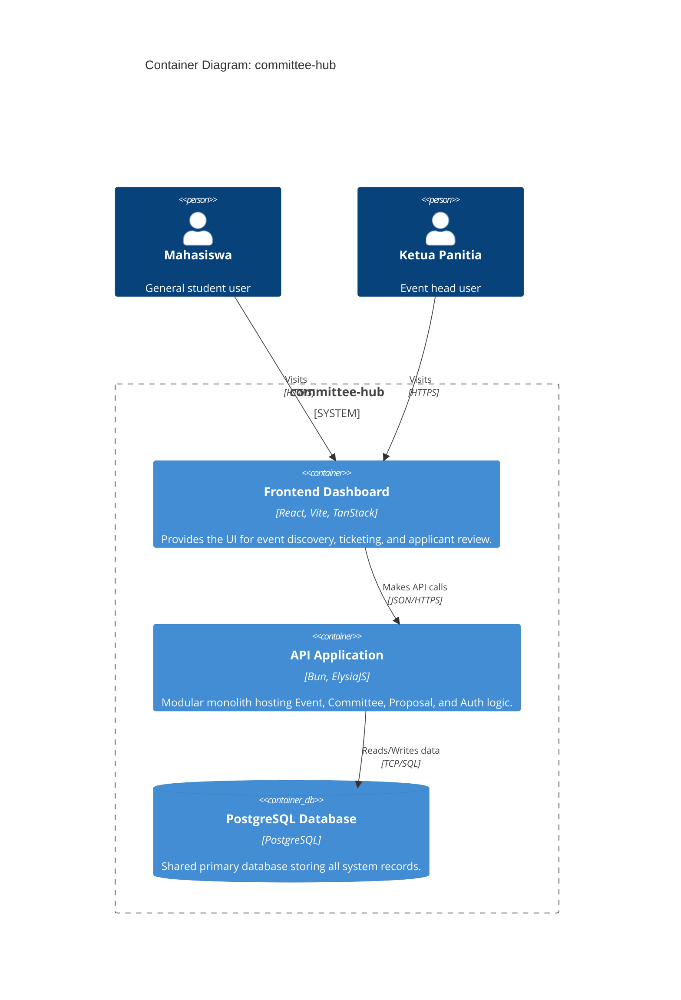
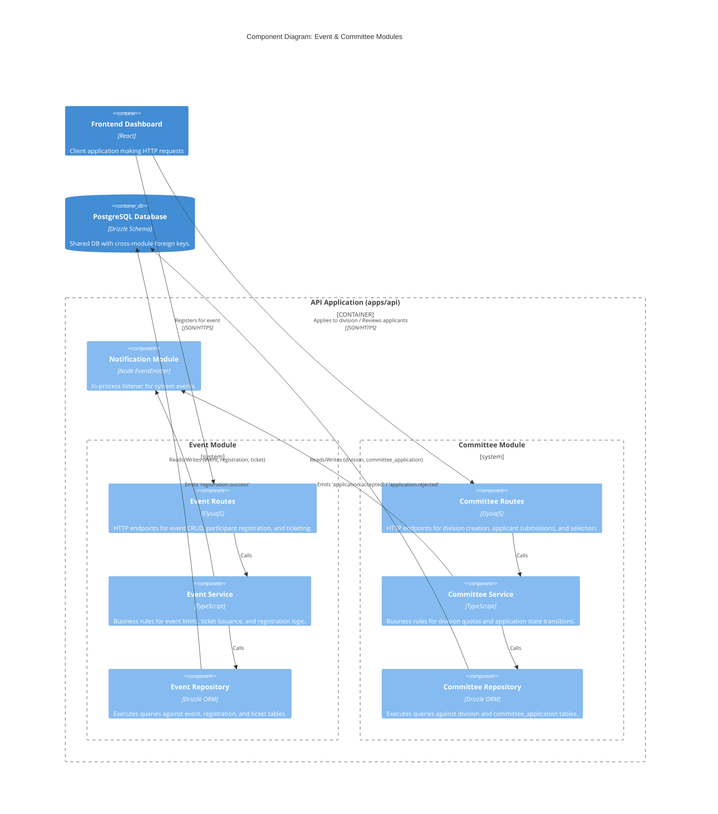

# C4 Architecture Documentation: Event & Committee Modules

This document provides a comprehensive structural overview of the `committee-hub` platform, specifically focusing on the newly implemented **Event** and **Committee** modules. The system architecture is modeled using the C4 framework (Context, Containers, and Components) to translate complex codebase boundaries into clear, navigable system designs.

---

## Level 1: System Context Diagram

The System Context diagram provides a high-level abstraction of how different human actors interact with the `committee-hub` boundary and establishes its core operational relationship with critical institutional infrastructure.

## Level 2: Container Diagram

The Container diagram focuses on the high-level technological breakdown of the platform, highlighting how the application logic is partitioned across runtime environments.

## Level 3: Component Diagram

The Component diagram dives directly into the internal architectural patterns of the API Application (apps/api), visualizing the layered structural approach (Routes, Services, and Repositories) used to construct both the Event and Committee domains.

